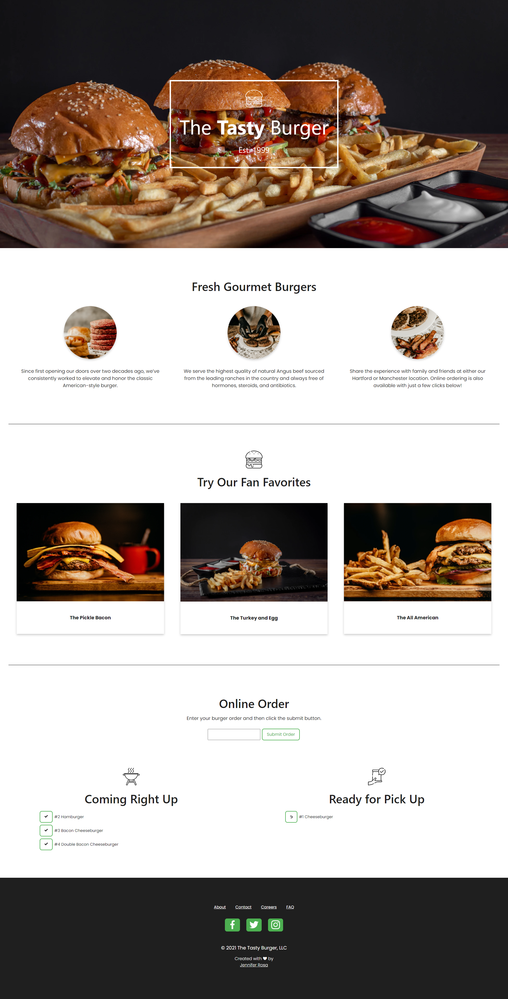
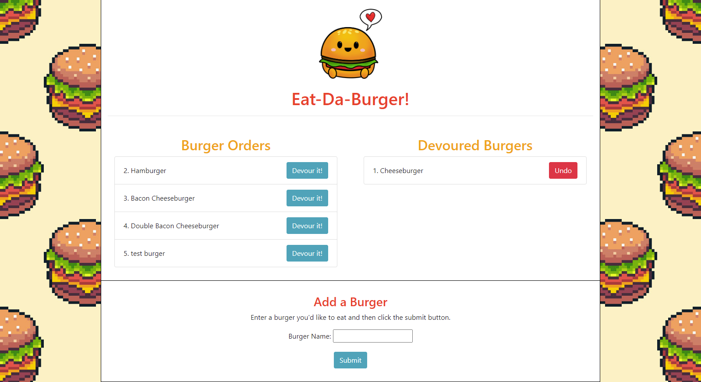

# 🍔 The Tasty Burger 

* A restaurant app that lets users input the names of burgers they'd like to eat.
* Whenever a user submits a burger's name, the app will display the burger on the left side of the page -- waiting to be devoured.
* Each burger in the waiting area also has a Devour it! button. When the user clicks it, the burger will move to the right side of the page.
* This app will store every burger in a database, whether devoured or not.

## Table of Contents
* [Deployment](#deployment)
* [Built With](#built-with)
* [Authors](#authors)
* [License](#license)
* [Acknowledgements](#acknowledgement)

## Deployment

### Version 2

Demo: https://rosa-burgerv2.herokuapp.com/

### Version 1

Demo: https://rosa-burger.herokuapp.com/

## Built With

* HTML
* CSS
* JavaScript
* Node.js
* Express
* MySQL
* Handlebars

## Authors

  - **Jennifer Rosa**
    [Rosajen27](https://rosajen27.github.io/)

## License

This project is licensed under the MIT License.

Copyright (c) 2021 Jennifer Rosa

Permission is hereby granted, free of charge, to any person obtaining a copy
of this software and associated documentation files (the "Software"), to deal
in the Software without restriction, including without limitation the rights
to use, copy, modify, merge, publish, distribute, sublicense, and/or sell
copies of the Software, and to permit persons to whom the Software is
furnished to do so, subject to the following conditions:

The above copyright notice and this permission notice shall be included in all
copies or substantial portions of the Software.

THE SOFTWARE IS PROVIDED "AS IS", WITHOUT WARRANTY OF ANY KIND, EXPRESS OR
IMPLIED, INCLUDING BUT NOT LIMITED TO THE WARRANTIES OF MERCHANTABILITY,
FITNESS FOR A PARTICULAR PURPOSE AND NONINFRINGEMENT. IN NO EVENT SHALL THE
AUTHORS OR COPYRIGHT HOLDERS BE LIABLE FOR ANY CLAIM, DAMAGES OR OTHER
LIABILITY, WHETHER IN AN ACTION OF CONTRACT, TORT OR OTHERWISE, ARISING FROM,
OUT OF OR IN CONNECTION WITH THE SOFTWARE OR THE USE OR OTHER DEALINGS IN THE
SOFTWARE.

## Acknowledgements

* Trilogy Education Services
